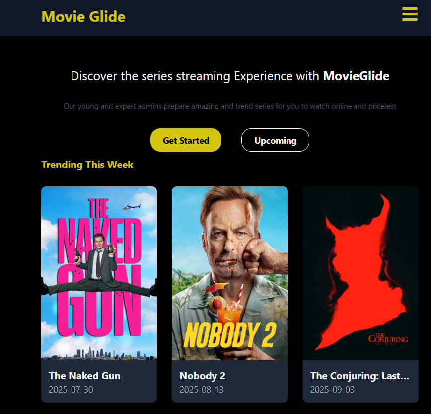

# 🎬 MovieGlide

A clean and responsive movie discovery web application built with modern front-end technologies. Browse trending and popular movies, and view detailed information for any title.



# ✨ Core Features
 Discover Movies: View lists of "Trending" and "Popular" movies on the homepage.

Detailed View: Click on any movie to see its full details, including overview, genres, and runtime.

Dynamic Routing: Seamless navigation between pages with unique URLs for each movie.

Responsive Design: A clean user interface that works perfectly on mobile, tablet, and desktop.

# 🛠️ Technology Stack

- Framework: React (with Vite)

- Styling: Tailwind CSS v4

- State Management: Zustand

- Routing: React Router

- Data Fetching: Axios

- API: The Movie Database (TMDb)

# 🚀 Getting Started

# Follow these steps to get a local copy of the project up and running.

# Prerequisites
- Node.js (v18 or higher)

- An API key from The Movie Database (TMDb)

# Installation

- Clone the repository:

- git clone https://github.com/alx-software-engineer/movieGlide.git

- cd movie-glide


# Install dependencies:

```npm install```

Set up environment variables:

Create a .env file in the root of your project.

Add your TMDb API key. The variable name must start with VITE_.

VITE_TMDB_API_KEY="your_api_key"

Run the development server:

`npm run dev`


# 👤 Author
# Abdulrazak Idris Yahaya

# GitHub: @Alx-software-engineer
